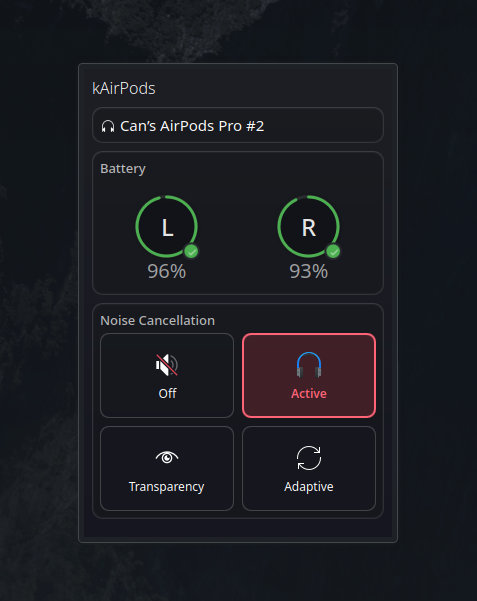

# KDE AirPods

[](https://www.gnu.org/licenses/gpl-3.0)
[](https://kde.org/plasma-desktop/)
[](https://www.rust-lang.org/)

Native AirPods integration for KDE Plasma 6 with a modern, fast Rust backend.



## Features

- **Real-time battery monitoring** for AirPods, case, and individual earbuds
- **Noise control** switching between ANC, Transparency, and Off modes
- **Ear detection** status and control
- **Native Plasma integration** with panel widget
- **Low-level Bluetooth L2CAP** communication for minimal latency
- **D-Bus service architecture** for system-wide availability

## Architecture

- **Backend**: Rust D-Bus service (`kde-airpods-service`) handling Bluetooth L2CAP communication
- **Frontend**: QML Plasmoid with modern UI components
- **IPC**: D-Bus interface at `org.kde.plasma.airpods`

## Quick Start

```bash
# Clone the repository
git clone https://github.com/can1357/kde-airpods.git
cd kde-airpods

# Build and install
./scripts/install.sh

# The service will start automatically via systemd
```

## D-Bus Interface

### Methods

- `GetDevices() → s` - Returns JSON array of all connected AirPods
- `GetDevice(address: s) → s` - Returns JSON state of specific device
- `SendCommand(address: s, action: s, params: a{sv}) → b` - Send commands to device
- `ConnectDevice(address: s) → b` - Connect to AirPods
- `DisconnectDevice(address: s) → b` - Disconnect from AirPods

### Signals

- `BatteryUpdated(address: s, battery: s)` - Battery level changes
- `NoiseControlChanged(address: s, mode: s)` - Noise control mode changes
- `DeviceConnected(address: s)` - Device connection events
- `DeviceDisconnected(address: s)` - Device disconnection events

### Example Usage

```bash
# List connected devices
busctl --user call org.kde.plasma.airpods /org/kde/plasma/airpods \
    org.kde.plasma.airpods GetDevices

# Set noise control to ANC
busctl --user call org.kde.plasma.airpods /org/kde/plasma/airpods \
    org.kde.plasma.airpods SendCommand "ss" "AA:BB:CC:DD:EE:FF" "set_noise_mode" 1 "value" "s" "anc"

# Monitor battery updates
busctl --user monitor org.kde.plasma.airpods
```

## Requirements

- KDE Plasma 6
- Rust toolchain
- BlueZ 5.50+
- D-Bus
- systemd (user services)

## License

This project is licensed under the GNU General Public License v3.0 or later - see the [LICENSE](LICENSE) file for details.

## Contributing

Contributions are welcome! Please feel free to submit a Pull Request.
